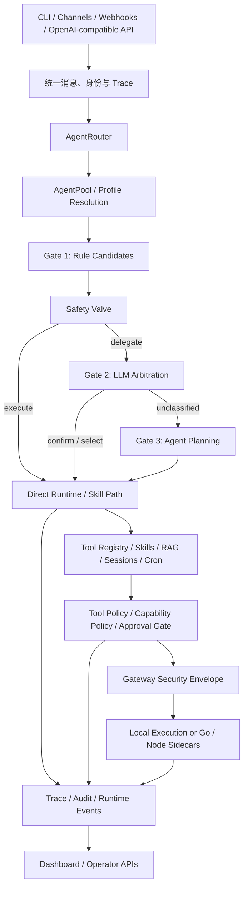
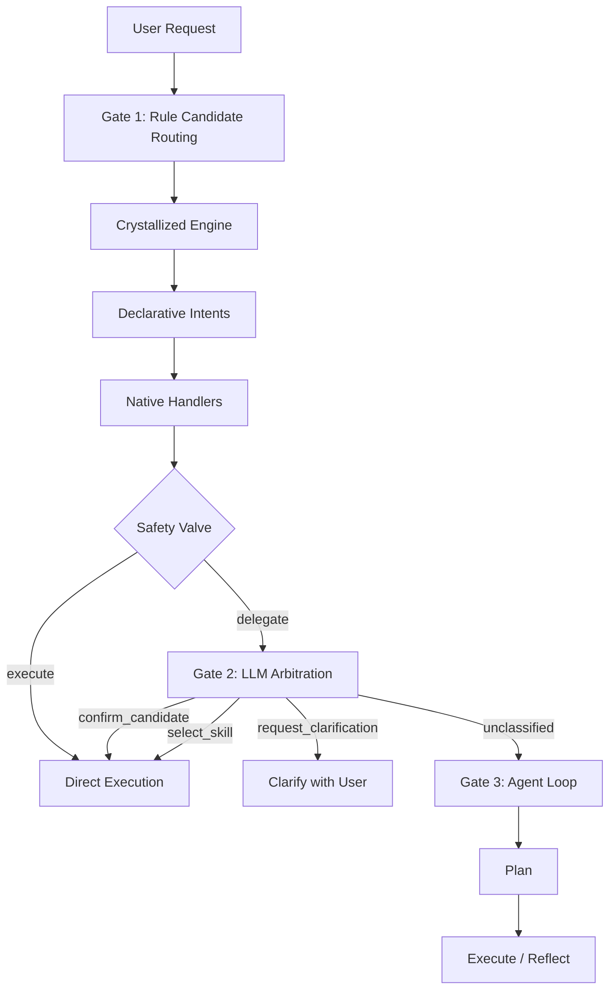
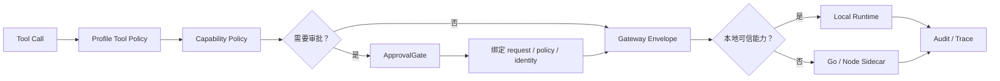

# zen-claw 当前架构设计与特色理念

> 本文描述当前代码已经形成的架构与设计理念，不描述尚未落地的目标架构。
> 事实来源优先级：当前代码与配置 > 测试和构建配置 > 其他项目文档。

## 1. 架构定位

zen-claw 的核心设计目标不是让大模型拥有尽可能大的自由度，而是在保留 Agent 开放式能力的同时，让执行路径具备以下属性：

- 可解释：能够说明请求为什么进入某条执行路径。
- 可约束：身份、Agent profile、渠道和能力策略共同限制工具使用。
- 可隔离：外部写操作与高风险能力可以在独立 sidecar 中执行。
- 可审计：审批、策略、请求和执行事件可以通过 trace 与哈希关联。
- 可运营：核心领域能力不仅能运行，也能通过 CLI、API 和 Dashboard 管理。
- 可降级：确定性能力、模型能力、外部服务和可选依赖失效时，有明确的失败或恢复路径。

因此，当前系统更接近一个“受治理的 Agent 执行平台”，而不是一个以 Prompt 为中心的聊天应用。

## 2. 整体架构



系统可以按六层理解：

1. **接入层**：CLI、渠道、Webhook 和兼容 API。
2. **路由层**：选择 Agent profile，并判断请求应走哪种执行路径。
3. **运行层**：Agent loop、直接执行、技能执行、会话和调度。
4. **能力层**：Tools、Skills、Knowledge/RAG、Crawler 和外围连接器。
5. **安全层**：身份、策略、审批、Gateway envelope 和 sidecar。
6. **控制面**：审计、可观测性、Dashboard 和管理 API。

## 3. 核心运行链路

### 3.1 从请求到 Agent

一个典型请求进入系统后：

1. 接入面创建或传播 `trace_id`，并提供渠道、发送者、会话、租户等元数据。
2. `AgentRouter` 按显式 Agent、绑定路由、关键词、渠道默认 profile 和默认 Agent 的顺序选择目标 Agent。
3. `AgentPool` 解析该 profile 的有效配置，并按需创建独立 `AgentLoop`。
4. Intent Router 先尝试已知的确定性路径，再决定是否进入受约束或自由规划。
5. 路由结果被转换为显式 `ExecutionIntent`。
6. 执行层根据 intent 选择直接执行、技能路径、澄清、审批等待、受约束重规划或完整 Agent loop。
7. 工具执行前继续经过工具策略、能力策略和审批判断。
8. 执行事件写入 trace、审计和控制面状态。

### 3.2 三门路由主链路

选定 Agent 后，`AgentLoop` 不会立即把所有请求交给自由规划模型，而是通过三门路由逐级扩大决策自由度。



| 路由门 | 核心职责 | 主要输入 | 可能输出 | 升级条件 |
| --- | --- | --- | --- | --- |
| Gate 1 | 用确定性规则产生并评估候选 | 请求、会话控制信号、crystallized / declarative / native 路由 | 直接执行候选，或 `delegate` | Safety Valve 判断候选不足以可靠执行 |
| Gate 2 | 用 LLM 在受约束选项中仲裁 | Gate 1 候选、技能信息、路由上下文 | `confirm_candidate`、`select_skill`、`request_clarification`、`unclassified` | 无法确认候选、选择技能或通过澄清解决 |
| Gate 3 | 在默认能力契约内自由规划和迭代执行 | 未分类请求、会话上下文、默认工具契约 | plan、execute、reflect 结果 | 仅由 Gate 2 的 `unclassified` 进入 |

Safety Valve 不是第四门，而是 Gate 1 与 Gate 2 之间的升级边界。它结合候选数量、置信度、残差比例、上下文代词和长度异常等运行时信号，决定确定性候选是否足以直接执行。

三门路由与 `AgentRouter` 解决的是不同层次的问题：`AgentRouter` 决定“由哪个 Agent 处理”，三门路由决定“选定 Agent 以何种决策自由度处理”。`orchestration.py` 将执行阶段归一化为 `gate1_execute`、`gate2_delegate`、`gate2_clarify` 和 `gate3_plan`，供运行追踪、评估和 Dashboard 使用。

### 3.3 从工具调用到高风险执行



高风险操作并不只依赖“工具名是否危险”这一项判断。执行上下文还可以包含：

- 来源渠道和发送者
- tenant / workspace / Agent profile
- trust level / trust tier
- capability grants
- resource scope
- 当前策略快照及其哈希
- request hash
- sidecar target

## 4. 特色设计理念

### 4.1 确定性优先，LLM 逐级升级

普通 Agent 常把所有请求直接交给同一个大模型循环。zen-claw 当前运行时把请求分成多种执行形态：

- Gate 1 优先使用 crystallized、declarative 和 native 路径形成确定性候选。
- Safety Valve 在候选不足时才将请求升级到 Gate 2。
- Gate 2 先进行受约束仲裁，只有 `unclassified` 才进入 Gate 3。
- `direct`：确定性运行时直接处理。
- `constrained_replan`：在已有 contract 下进行受约束重规划。
- `skill_path`：进入明确技能路径。
- `clarification`：信息不足时先澄清。
- `approval_wait`：高风险能力等待授权。
- `gate3_plan` / `agent_loop`：无法收束时才进入开放式规划。

这套设计的价值：

- 简单任务不必消耗完整 Agent loop。
- 已知任务可保持稳定输出与错误语义。
- LLM 仍可处理未知或复杂请求，但不会成为唯一执行入口。
- 可以分别观察和测试“路由正确性”和“执行正确性”。

关键代码：

- `zen_claw/agent/intent_router.py`
- `zen_claw/agent/orchestration.py`
- `zen_claw/agent/loop.py`

### 4.2 从 BitNet b1.58 借鉴离散控制理念

[BitNet b1.58 论文](https://arxiv.org/abs/2402.17764)的核心工作是让模型权重只使用 `{-1, 0, +1}` 三个值，以更低的计算、内存和能耗成本保持有竞争力的模型能力。zen-claw 当前没有实现 BitNet 模型或 1.58-bit 推理运行时，而是把“三值离散化”和“把复杂度留给不确定部分”作为系统设计启发。

仓库中的直接落地包括：

- `TernaryRecallStrategy` 将连续召回分数划分为 `Reject(-1)`、`Uncertain(0)`、`Accept(+1)`。
- 明确接受和拒绝的记忆候选直接收束；只有 `Uncertain(0)` 候选进入二次评分，减少噪声和上下文 token 消耗。
- `TriternaryRecallStrategy` 可以直接向调用方返回 `{-1.0, 0.0, 1.0}` 离散分数。
- 顶层工具策略通过结构化放行/拒绝原因、审批路径和 deny short-circuit，将高风险执行收束为可审计决策，而不是让 LLM 自行解释安全边界。

项目规划将这些思想组织为“三明治”演进方向：

```text
底层：b1.58-inspired 三值记忆检索
中层：Intent Router / Gate 1-3 / 规划与候选仲裁
顶层：Tool Policy / Approval / Gateway 硬门控
```

需要区分两个容易混淆的概念：

- **三门路由不是 b1.58 三值的直接映射。** Git 历史显示，Gate 1 / Gate 2 / Gate 3 在 2026-03-29 已完成对齐；b1.58 可行性评估形成于 2026-04-06，并把三门路由视为已有基础。
- **二者共享同一类控制哲学。** 优先走低成本、可解释的确定路径；将不确定项升级给更强但更贵的决策层；最终执行仍受硬策略约束。
- **MHA 中层候选排序仍是规划项。** 当前 Gate 1 使用 crystallized、declarative、native 的顺序匹配，不能描述为已经实现多头注意力路由。

因此，b1.58 对当前项目的准确影响不是“创造了三门路由”，而是强化并扩展了项目已有的分层控制方向，使其进一步覆盖记忆召回、路由规划和顶层安全门控。

关键代码与证据：

- `zen_claw/agent/memory_ternary.py`
- `zen_claw/agent/context.py`
- `zen_claw/agent/tools/policy.py`
- `zen_claw/agent/approval_gate.py`
- `docs/design/MHA_b158_feasibility_assessment_20260406.md`
- `docs/backlog.md`

### 4.3 路由决策与执行意图显式解耦

当前代码没有把路由结果仅保存在临时字符串或分支条件中，而是定义了独立契约：

- `RouteCandidate`：规则层产生的候选。
- `RoutingDecision`：决定执行还是委托。
- `ArbitrationDecision`：表达分类、技能选择或澄清。
- `ExecutionIntent`：描述实际执行路径、模式、操作风险和并发类型。
- `ExecutionResult`：表达成功、失败、澄清、审批或委托结果。

这是一个重要设计选择：**“理解用户想做什么”与“允许系统怎么做”不是同一个问题。**

显式契约让控制面、审计、测试和未来执行器可以共享稳定语义，而不必解析 Agent loop 内部状态。

### 4.4 Multi-Agent 以隔离和策略为中心

多 Agent 设计不只是创建多个 Prompt。每个 profile 可以解析出自己的：

- workspace
- model stack
- system prompt
- skills
- tool allow/deny
- planning 和反思配置
- memory recall mode
- allowed channels
- trusted-local 限制

Agent 路由与 Agent 实例解析也被拆开：

- `AgentRouter` 负责选择 profile。
- `AgentPool` 负责解析 profile 并管理运行实例。

这种设计使 Agent profile 更像“可部署的执行身份”，而不是一个聊天角色。

关键代码：

- `zen_claw/agent/router.py`
- `zen_claw/agent/pool.py`
- `zen_claw/config/schema.py`

### 4.5 请求携带可验证的零信任安全上下文

zen-claw 的安全设计不是仅在入口检查一次权限。`GatewayControlPlane` 会为请求签发包含身份和策略的安全 envelope。

Envelope 中包含：

- subject identity
- tenant / workspace / Agent profile
- trust level / tier
- capability grants
- policy snapshot
- policy snapshot hash
- request hash
- gateway instance
- gateway signature

Envelope 使用稳定 JSON canonicalization 生成哈希与签名，并可由 Python、Go、Node 执行边界进行一致性验证。

这一设计的核心理念是：

> 执行端不应仅信任“调用来自主进程”，而应验证这次请求是谁发起、允许做什么、策略是什么，以及请求是否在传输中发生变化。

关键代码：

- `zen_claw/security_context.py`
- `zen_claw/gateway/service.py`
- `tests/fixtures/gateway_canonicalization_golden.json`
- `go/sec-execd/`
- `go/net-proxy/`
- `browser/sidecar/`

### 4.6 Fail-Closed 是生产加固的默认方向

当 `production_hardening` 开启时，配置 schema 会主动拒绝不满足安全要求的组合，例如：

- legacy compatibility
- 非 HMAC sidecar approval mode
- 未使用规范 `tools.network.*` 配置
- 非 localhost sidecar 缺少 TLS

外部渠道写操作也遵循类似原则：

- 本地可信渠道可以走本地路径。
- 外部渠道存在 connector sidecar 时走隔离路径。
- 外部渠道没有 sidecar 时阻止发送，而不是静默直连。

这体现了一个明确取舍：生产加固模式优先暴露配置缺口，而不是为了“看起来能运行”而绕过边界。

关键代码：

- `zen_claw/config/schema.py`
- `zen_claw/agent/tools/capability_policy.py`
- `zen_claw/channels/outbound_adapter.py`

### 4.7 审批是一次性、带上下文的执行授权

`ApprovalGate` 不只记录“用户点了同意”。审批记录绑定：

- session
- tool 与参数
- capability 与 resource scope
- security context
- policy snapshot hash
- request hash
- sidecar target
- TTL

批准后的记录在匹配执行时会被消费，避免被复用于其他调用。

这使审批更接近一次具体能力授权，而不是一个全局开关。

关键代码：

- `zen_claw/agent/approval_gate.py`

### 4.8 审计不仅记录事件，还验证完整性

审计记录采用 JSONL，可输出到本地文件、HTTP sink 或 syslog。默认本地审计包含：

- 前一条记录哈希
- 当前记录哈希
- 记录签名
- trace ID
- 结构化事件字段

系统还可以验证：

- 审计哈希链是否被破坏
- 签名是否有效
- 同一 trace 下审批、工具和外发事件的 request/policy 是否一致

因此，可观测性不仅回答“发生了什么”，也参与回答“记录是否可信、执行链是否一致”。

关键代码：

- `zen_claw/observability/trace.py`
- `zen_claw/observability/audit.py`
- `zen_claw/dashboard/server.py`

### 4.9 Skills 是受治理的软件包

在 zen-claw 中，Skill 不只是插入 system prompt 的 Markdown。Skills 系统包含：

- manifest 与权限声明
- 多来源发现：内置、本地目录、GitHub、HTTPS registry
- 签名快照与过期时间
- 一次性 snapshot install
- HTTPS、SSRF 和 digest 校验
- zip 大小、文件数和路径深度限制
- staging、审查、安装、导出、恢复和 SBOM
- turn boundary 热加载

这套设计把技能扩展视为供应链问题和运行时权限问题，而不是单纯内容加载问题。

关键代码：

- `zen_claw/agent/skills.py`
- `zen_claw/skills/registry.py`
- `zen_claw/skills/sources.py`

### 4.10 一个领域抽象服务多个产品表面

项目倾向于先建立领域层抽象，再让多个入口复用，而不是分别为 CLI、API 和 Dashboard 实现业务逻辑。

典型例子：

- `RAGPipeline` 同时服务 CLI、API、Dashboard、Crawler 和 Cron。
- Agent profile 解析同时服务 CLI、Gateway 和 Dashboard。
- Channel registry 同时描述 bootstrap、状态、控制能力和 Dashboard readiness。
- Skills loader 同时服务运行时、CLI 和控制面。

这种设计降低了“命令行行为、API 行为、Dashboard 行为彼此漂移”的风险。

### 4.11 渠道以能力契约描述差异

不同渠道的传输、认证、媒体和运行时能力差异很大。项目没有假设所有渠道完全同构，而是使用共享 `ChannelSpec` 描述：

- transport
- inbound mode
- verify mode
- media mode
- webhook / passive 能力
- runtime actions
- error semantics

控制面能够据此区分：

- 已支持的 Alpha contract 能力
- 缺失能力
- 真正的进程内控制
- 仅审计或配置层控制

这种方式比简单的 `enabled=true/false` 更能表达渠道真实成熟度。

关键代码：

- `zen_claw/channels/registry.py`
- `zen_claw/channels/manager.py`

### 4.12 Local-First 不等于单进程

项目的数据、配置、知识库、审批和审计默认可以保存在本地，但高风险执行并不要求全部留在 Python 主进程。

当前组合是：

- Python：主运行时、领域能力和控制面。
- Go：安全命令执行与网络代理。
- Node：浏览器自动化与 WhatsApp bridge。

这是“本地控制权”与“进程隔离”并存的设计，而不是把 local-first 理解为所有能力都在一个进程内直接执行。

### 4.13 恢复和降级路径是一等执行结果

运行时将失败、澄清、审批等待、受约束重规划和委托视为不同结果，而不是统一压缩为异常或空回复。

这一理念体现在：

- `ExecutionResult` 的明确状态
- direct intent 的结构化恢复
- 工具结果的错误分类
- RAG backend diagnostics
- channel runtime capability 与 readiness
- provider fallback 和受约束重规划

这使系统能够区分：

- 请求本身无法完成
- 当前来源暂时失败
- 缺少权限或配置
- 需要用户补充信息
- 应升级到更开放的执行路径

## 5. 控制面设计

Dashboard 不是独立于运行时的展示项目，而是围绕当前领域对象提供操作面。

当前控制面覆盖：

- Agent inventory、profile detail、route preview 和部分配置变更
- Skills inventory、preflight、安装、导出和恢复
- Channel readiness、状态和部分 apply 操作
- RAG notebook、tenant policy、retention 和 backend diagnostics
- Crawler、Cron、模型路由和运行摘要
- 安全审计、审批活动和 replay consistency

控制面设计遵循两个原则：

1. **先展示真实能力边界，再提供操作按钮。**
2. **区分配置已修改、待应用、审计确认和真正的进程内执行。**

## 6. 关键设计取舍

| 设计选择 | 获得的能力 | 代价 |
| --- | --- | --- |
| 显式路由与执行契约 | 可测试、可解释、可观测 | 类型和状态转换更多 |
| b1.58-inspired 离散决策与不确定态升级 | 降低召回噪声与无效高级决策成本 | 阈值、边界条件和二次判定需要持续评测 |
| Profile 级隔离 | 多 Agent 行为与权限边界清晰 | 配置解析更复杂 |
| Fail-closed sidecar | 外部写操作和高风险执行边界更强 | 本地部署需要更多组件 |
| 签名 envelope 与策略快照 | 跨进程请求可验证 | 跨语言 canonicalization 必须严格一致 |
| Skills 供应链治理 | 第三方扩展更可控 | 安装流程比直接复制 Markdown 更重 |
| 统一领域 pipeline | CLI/API/Dashboard 行为更一致 | 领域层需要保持稳定契约 |
| 能力描述型渠道注册表 | 能表达真实渠道成熟度 | 不能假装所有渠道拥有相同能力 |
| 本地 JSONL 审计链 | 易部署且可验证 | 大规模部署仍需外部审计 sink |

## 7. 当前架构边界

以下内容需要明确看作当前边界，而不是已完全解决的问题：

- 项目仍处于 Alpha 阶段，各模块成熟度不一致。
- 部分 Dashboard mutation 是配置或审计层操作，并非真实热加载。
- sidecar 增强了隔离，但部署者仍需正确配置网络、TLS、凭证和进程权限。
- 本地 JSONL、文件状态和内存锁适合当前基线，不等同于分布式一致性存储。
- 多 Agent 已具备 profile、路由和隔离，但不是通用 DAG/工作流编排引擎。
- RAG 已具备统一 pipeline 与策略层，但后端和索引调优能力仍有限。
- Skills 的治理基线较完整，但第三方生态质量仍取决于来源与审核。
- 当前控制面集中在单个较大的 FastAPI server 模块，未来继续扩展时需要关注模块拆分。

## 8. 代码阅读路径

建议按以下顺序理解当前架构：

1. `zen_claw/config/schema.py`：系统允许配置什么，以及生产加固约束。
2. `zen_claw/agent/orchestration.py`：路由和执行之间的契约。
3. `zen_claw/agent/router.py` 与 `pool.py`：多 Agent 路由和实例解析。
4. `zen_claw/agent/loop.py`：核心运行时如何组合这些能力。
5. `zen_claw/security_context.py` 与 `gateway/service.py`：零信任请求上下文。
6. `zen_claw/agent/tools/policy.py` 与 `capability_policy.py`：工具和能力策略。
7. `zen_claw/agent/approval_gate.py`：敏感操作授权。
8. `zen_claw/observability/audit.py`：审计完整性和 replay consistency。
9. `zen_claw/knowledge/pipeline.py`：统一领域 pipeline。
10. `zen_claw/channels/registry.py`：能力描述型渠道抽象。
11. `zen_claw/agent/skills.py`：Skills 供应链与运行时治理。
12. `zen_claw/dashboard/server.py`：控制面如何映射运行时能力。

## 9. 一句话总结

zen-claw 当前最鲜明的架构理念是：

> 让 Agent 保留开放式智能，但把“选择谁执行、允许怎么执行、执行了什么、记录是否可信”变成显式、可验证、可运营的软件系统能力。
